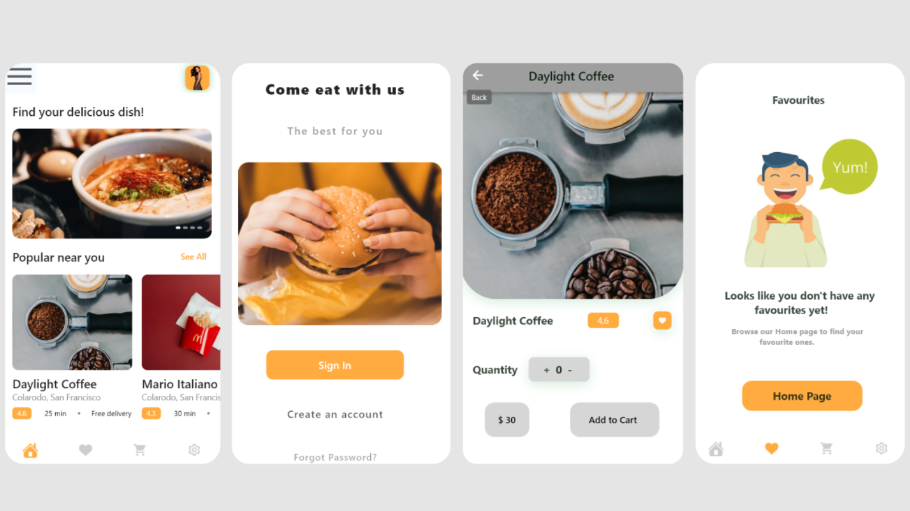

# Title: FoodApp - Delightful Dining at Your Fingertips

# Description
Welcome to FoodApp, your ultimate destination for culinary exploration and convenience. Crafted with precision using the Flutter framework, FoodApp redefines your food shopping experience by offering a wide array of delectable dishes right at your fingertips. From the enticing splash screen to the effortless ordering process, FoodApp promises to make your dining journey a delightful one.
## Screenshot 📷
  

# Key Features

# Captivating Splash Screen:
FoodApp greets you with a mesmerizing splash screen, a visual treat that sets the stage for your gastronomic adventure. Watch as sumptuous dishes come to life, capturing the essence of FoodApp's commitment to quality and taste.
# Diverse Food Selection:
Dive into a world of flavors with FoodApp's extensive food selection. Explore a variety of cuisines, from comfort food to exotic delicacies, ensuring there's something to satisfy every palate.
# User-Friendly Navigation:
Discovering your favorite dishes has never been easier. FoodApp's intuitive navigation allows you to seamlessly explore categories, making it effortless to find and select your desired items
# Customizable Order Quantities:
Tailor your order to suit your cravings. With FoodApp, you can choose the quantity of each food item, ensuring you enjoy just the right portion for your appetite.
# Responsive Design:
Whether you're browsing on a smartphone, tablet, or desktop, ChairEase's responsive design ensures a consistent and enjoyable experience across all devices.

A new Flutter project.

## Getting Started

This project is a starting point for a Flutter application.

A few resources to get you started if this is your first Flutter project:

- [Lab: Write your first Flutter app](https://docs.flutter.dev/get-started/codelab)
- [Cookbook: Useful Flutter samples](https://docs.flutter.dev/cookbook)

For help getting started with Flutter development, view the
[online documentation](https://docs.flutter.dev/), which offers tutorials,
samples, guidance on mobile development, and a full API reference.
